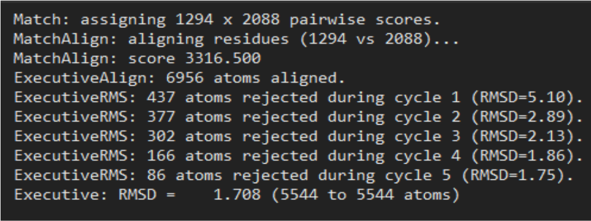
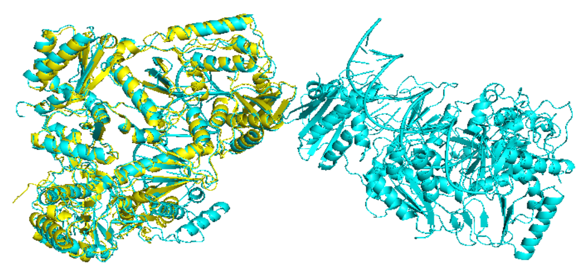
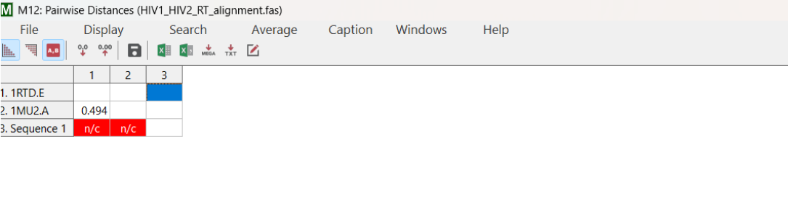
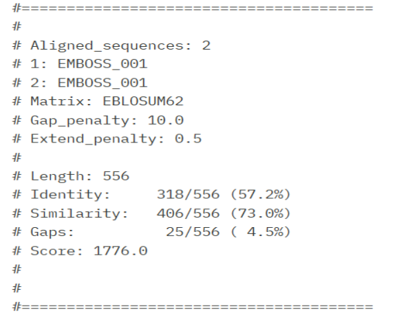

# HIV-RT-Comparative-Analysis
Comparative structural and sequence analysis of HIV-1 and HIV-2 Reverse Transcriptase using NCBI, Clustal Omega, MEGA 12, and PyMOL
# Comparative Structural Analysis of HIV-1 and HIV-2 Reverse Transcriptase

## Overview
This project performs a comparative sequence and structural analysis of HIV-1 and HIV-2 
Reverse Transcriptase (RT) proteins using bioinformatics tools to identify similarities, 
differences, and conserved regions between the two viruses.

**Institution:** Loyola Academy Degree & PG College, Secunderabad  
**Affiliation:** Osmania University  
**External Lab:** Bharathi Biologicals Lab, Sainikpuri, Hyderabad  
**Supervisor:** Dr. A.B. Balaji, Molecular Bioinformatics and Data Science, R&D Division  
**Degree:** BSc Biotechnology, Genetics and Chemistry  
**Year:** 2026  

---

## Aim
To perform a comparative sequence and structural analysis of HIV-1 and HIV-2 Reverse 
Transcriptase proteins using bioinformatics tools in order to identify similarities, 
differences, and conserved regions between the two viruses.

---

## Objectives
- Collect HIV-1 and HIV-2 nucleotide and protein sequences from NCBI and PDB databases
- Compare nucleotide sequences using Clustal Omega multiple sequence alignment
- Identify conserved regions, mutations, insertions, deletions, and sequence variations
- Analyze structural differences using PyMOL visualization
- Understand how sequence variations influence structural and functional differences
- Interpret evolutionary relationships based on sequence similarity and alignment patterns

---

## Datasets Used

| Protein | PDB ID | Chain | Description |
|---------|--------|-------|-------------|
| HIV-1 Reverse Transcriptase | 1RTD | Chain E | Catalytically active RT chain |
| HIV-2 Reverse Transcriptase | 1MU2 | Chain A | RT protein chain |

**Note:** HIV-1 RT structure 1RTD Chain A was identified as a DNA template strand 
and excluded from protein-based comparison. Only Chain E (protein) was used.

---

## Tools and Software Used

| Tool | Purpose |
|------|---------|
| NCBI Database | Sequence and structure retrieval |
| Clustal Omega | Multiple sequence alignment |
| MEGA 12 | Phylogenetic and evolutionary analysis |
| MUSCLE algorithm | Multiple sequence alignment within MEGA |
| PyMOL | 3D structural visualization and superposition |
| EMBOSS | Global sequence alignment statistics |
| RCSB Protein Data Bank | 3D protein structure retrieval |

---

## Methodology

### 1. Sequence Collection
- HIV-1 and HIV-2 nucleotide sequences retrieved from NCBI database in FASTA format
- HIV-1 sequence length: ~2310 base pairs
- HIV-2 sequence length: ~1560 base pairs
- 3D protein structures downloaded from RCSB PDB (1RTD and 1MU2)

### 2. Sequence Alignment
- Nucleotide sequences aligned using Clustal Omega
- Conserved regions, mutations, insertions, and deletions identified
- Matching nucleotides represented by asterisk (*) symbols
- Gaps (-) represented missing or inserted regions

### 3. Structural Analysis using PyMOL
- PDB files loaded and visualized in cartoon format
- HIV-2 RT (1MU2) aligned onto HIV-1 RT (1RTD) using align command
- Structures colored: HIV-1 RT = cyan, HIV-2 RT = yellow
- High resolution image rendered using ray 2500,2500
- Session saved as HIV_alignment_session.pse

### 4. Evolutionary Analysis using MEGA 12
- Protein sequences imported into MEGA alignment editor
- MUSCLE algorithm used for multiple sequence alignment
- Pairwise distance calculated using Poisson correction model
- Gaps treated using pairwise deletion method

### 5. Global Alignment using EMBOSS
- Global alignment performed between HIV-1 RT and HIV-2 RT protein sequences
- EBLOSUM62 matrix used with gap penalty 10.0

---

## Key Results

### Structural Superposition (PyMOL)
- RMSD value: **1.708 Å** (5544 atoms aligned)
- Strong conservation observed in major functional domains
- Fingers, Palm, Thumb, Connection, and RNase H domains — all conserved
- Structural differences observed in flexible loop regions and outer helices
- Notable insertion/deletion event near C-terminal region (~500–550 residues)

### Evolutionary Distance (MEGA 12)
| Comparison | Pairwise Distance |
|------------|------------------|
| HIV-1 RT (1RTD.E) vs HIV-2 RT (1MU2.A) | **0.494** |

Pairwise distance of 0.494 indicates moderate evolutionary divergence — proteins are 
related but have accumulated significant sequence variations.

### Sequence Alignment Statistics (EMBOSS)
| Metric | Value |
|--------|-------|
| Alignment Length | 556 residues |
| Identity | 318/556 (57.2%) |
| Similarity | 406/556 (73.0%) |
| Gaps | 25/556 (4.5%) |
| Alignment Score | 1776.0 |

---

## Key Finding
During analysis it was identified that HIV-1 RT structure (PDB: 1RTD) Chain A 
corresponds to a DNA template strand and not the RT protein. Therefore Chain A 
was excluded from protein-based sequence alignment and structural comparison. 
Only Chain E (protein chain) was selected for valid comparative analysis.

---

## Biological Significance
- Conserved functional domains confirm both HIV-1 and HIV-2 RT perform same enzymatic function
- Moderate divergence (0.494) explains why HIV-2 shows natural resistance to several NNRTIs
- Structural differences in NNRTI binding pocket may reduce inhibitor binding efficiency
- Findings support importance of HIV-1 vs HIV-2 specific drug design strategies

---

## Output Files Generated
- HIV1_HIV2_RT_superposition.png — High resolution structural superposition image
- HIV_alignment_session.pse — PyMOL session file
- HIV1_HIV2_superposed.pdb — Combined aligned PDB coordinate file

---

## References
- Berman HM et al. The Protein Data Bank. Nucleic Acids Research. 2000
- Kumar S et al. MEGA X. Molecular Biology and Evolution. 2018
- Schrödinger LLC. PyMOL Molecular Graphics System Version 2.0
- Altschul SF et al. BLAST. Journal of Molecular Biology. 1990
- Ren J et al. Structure of HIV-2 RT. PNAS. 2002
- Kohlstaedt LA et al. Crystal structure of HIV-1 RT. Science. 1992
- ---
### Figure 16 — PyMOL Structural Alignment Output Showing RMSD Value

### Figure 17 — Superposition of HIV-1 RT and HIV-2 RT Structures

### Figure 20 — MEGA Pairwise Distance Matrix

### Figure 21 — EMBOSS Alignment Statistics

